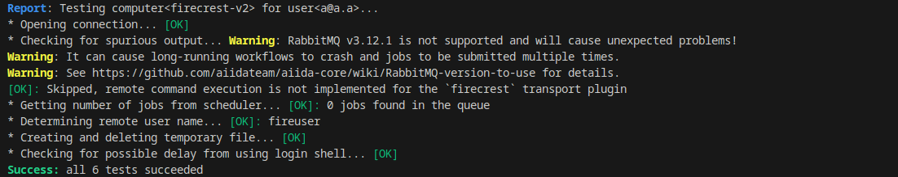

# aiida-firecrest

[![Coverage Status][codecov-badge]][codecov-link]
[![Code style: black][black-badge]][black-link]

<br>
<div align="left">
  
</div>
<br>

**AiiDA transport and scheduler plugins for interfacing with [FirecREST](https://products.cscs.ch/firecrest/) via [pyfirecrest](https://github.com/eth-cscs/pyfirecrest).**

---

## Installation

You can install the package either from GitHub or PyPI:

```bash
pip install aiida-firecrest
```

Once installed, verify that the `firecrest` transport and scheduler plugins are available in AiiDA:

```bash
$ verdi plugin list aiida.transports firecrest
Transport interface for FirecREST.
Must be used in conjunction with the 'firecrest' scheduler plugin.

$ verdi plugin list aiida.schedulers firecrest
Scheduler interface for FirecREST.
Must be used in conjunction with the 'firecrest' transport plugin.
```

You can then setup a `Computer` in AiiDA:

```bash
$ verdi computer setup --transport firecrest --scheduler firecrest --hostname firecrest --label <YOUR_LABEL>
```

After completing the prompts, configure the computer with your credentials:

```bash
$ verdi -p <MY_PROFILE> computer configure firecrest <YOUR_LABEL>
```

Finally, test the setup:

```bash
$ verdi computer test <YOUR_LABEL> --print-traceback
```

Expected output:

<br>
<div align="left">
  
</div>
<br>


After this, AiiDA should be able to interact with FirecREST seamlessly.
See [`tests/test_calculation.py`](tests/test_calculation.py) for a working example using the plugin through the AiiDA API.


Also consider exploring the [pyfirecrest CLI](https://github.com/eth-cscs/pyfirecrest) for direct interaction with a FirecREST server.

> If you encounter any problems/bug, please don't hesitate to open an issue on this repository.

---

## For developers

### Development Installation

Clone and install the package in development mode:

```bash
git clone https://github.com/aiidateam/aiida-firecrest.git
cd aiida-firecrest
pip install -e .[dev]
```

### Testing

To run the tests, you'll first need access to a FirecREST server. A simple way to do that locally, is to use the [firecrest-v2 repo](https://github.com/eth-cscs/firecrest-v2) and spin up the Docker container --which is how we do it in the CI:

```bash
git clone https://github.com/eth-cscs/firecrest-v2
cd firecrest-v2
docker compose -f 'docker-compose.yml' up -d --build
```

By default, `pytest` will use the `.firecrest-demo-config.json` configuration file to connect to the the local Docker-based FirecREST server:

```plaintext
┌─────────────────┐───►┌─────────────┐───►┌──────────────────────────────┐
│ aiida_firecrest │    │ pyfirecrest │    │ FirecREST deployed on docker │
└─────────────────┘◄───└─────────────┘◄───└──────────────────────────────┘
```


You can also test against a real FirecREST server by supplying your own config file:

```bash
pytest --firecrest-config="MY_CONFIGURATION.json"
```

Make sure the configuration is similarly structured as in `.firecrest-demo-config.json`. Note that tests involving job submission may experience timeouts due to actual HPC queue wait times.

```plaintext
┌─────────────────┐───►┌─────────────┐───►┌────────────────────────────────┐
│ aiida_firecrest │    │ pyfirecrest │    │ FirecREST on a real HPC server │
└─────────────────┘◄───└─────────────┘◄───└────────────────────────────────┘
```

### Debugging and CLI Access

For debugging or direct file system access, consider using the [`pyfirecrest` CLI](https://pyfirecrest.readthedocs.io/en/stable/tutorial_cli.html).
For example, after setting the appropriate environment variables, you can run:

```bash
$ firecrest ls /home/fireuser/
```

---

### Code Style

Before committing any changes, ensure the code is properly formatted and linted:

```bash
pre-commit run --all-files
```

---

### Acknowledgment:

This project is supported by SwissTwins project.

<br>
<div align="left">
  
</div>
<br>

[codecov-badge]: https://codecov.io/gh/aiidateam/aiida-firecrest/branch/main/graph/badge.svg
[codecov-link]: https://codecov.io/gh/aiidateam/aiida-firecrest
[black-badge]: https://img.shields.io/badge/code%20style-black-000000.svg
[black-link]: https://github.com/ambv/black
